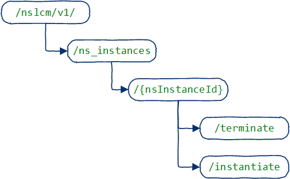

# Multi-Site Network Orchestrator

The Multi-Site Network Orchestrator is part of the Interworking Framework, as described in 

,
and .

This document describes the supported services for the *MS8* drop.

## Supported services
The following figure includes the resource URI structure supported by the Multi-Site Network Orchestrator:

The following table contains the list of services included in this drop:

| Resource Name | Resource URI | HTTP Method | Description |
|:-------------:|:------------:|:----------- |:----------- |
| NS Instances  | /ns_instances | GET | Returns the list of onboarded NS information
| NS Instances  | /ns_instances | POST | Creates a new NS into the MSNO
| Individual NS Instances  | /ns_instances/{nsInstanceId} | GET | Returns the information of a NS
| Individual NS Instances  | /ns_instances/{nsInstanceId} | DELETE | Deletes a NS from MSNO
| Instantiate NS | /ns_instances/{nsInstanceId}/instantiate | POST | Instantiates a NS into target site
| Terminate NS | /ns_instances/{nsInstanceId}/terminate | POST | Terminates an instantiated NS

## Workflows (TBC)