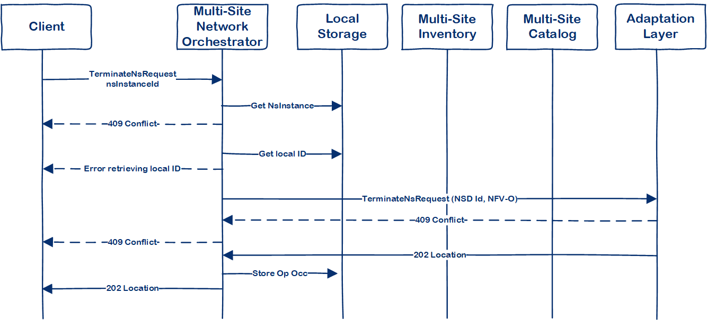

# Multi-Site Network Orchestrator

The Multi-Site Network Orchestrator is part of the Interworking Framework, as described in 
[D3.1](https://www.5g-eve.eu/wp-content/uploads/2019/01/5geve-d3.1-interworking-capability-gap-analysis.pdf)
,[D3.2](https://www.5g-eve.eu/wp-content/uploads/2019/09/5geve_d3.2-interworking-reference-model.pdf)
and [D3.3](https://www.5g-eve.eu/wp-content/uploads/2019/11/5g-eve-d3.3-first-implementation-of-the-interworking-reference-model.pdf).

This document describes the supported services for the *MS8* drop.

## Supported services
The following figure includes the resource URI structure supported by the Multi-Site Network Orchestrator:

The following table contains the list of services included in this drop:

| Resource Name | Resource URI | HTTP Method | Description |
|:-------------:|:------------:|:----------- |:----------- |
| NS Instances  | /ns_instances | GET | Returns the list of onboarded NS information
| NS Instances  | /ns_instances | POST | Creates a new NS into the MSNO
| Individual NS Instances  | /ns_instances/{nsInstanceId} | GET | Returns the information of a NS
| Individual NS Instances  | /ns_instances/{nsInstanceId} | DELETE | Deletes a NS from MSNO
| Instantiate NS | /ns_instances/{nsInstanceId}/instantiate | POST | Instantiates a NS into target site
| Terminate NS | /ns_instances/{nsInstanceId}/terminate | POST | Terminates an instantiated NS

## Workflows

### Create NS Request
This request creates (onboard) a Network Service in the MSNO. 
The resource URI is:
**{apiRoot}/mslcm/v1/ns_instances**, and the resource method is *POST*

1. Client sends a CreateNSRequest
2. MSNO generates a unique UUID
3. MSNO stores the NS in the local storage
4. Response includes the UUID for the NS and the link to the resource

### Query NS Instances

*Note*: this services returns the current status of the NS in the **MSNO**. It **might** be outdated information as it 
is not synced with the 5G EVE sites

The resource URI is:
**{apiRoot}/mslcm/v1/ns_instances**, and the resource method is *GET*

### Query NS Instance
Returns the information and status of the NS instance. This method syncs with the 5G EVE site to retrieve the last 
update of the NS.

The resource URI is:
**{apiRoot}/mslcm/v1/ns_instances/{nsInstanceId}**, and the resource method is *GET*

1. Client sends a GET request including NS instance ID
2. MSNO retrieves NS Instance local information
3. MSNO retrieves local NS ID. 
4. In case that NS has not instantiated yet, MSNO returns local information
5. In case that NS has been instantiated, MSNO retrieves NS information from the local site
6. Local NS information is updated
7. Updated NS information is sent to the client

### Instantiate NS
Instantiates a NS in the target 5G EVE site

The resource URI is:
**{apiRoot}/mslcm/v1/ns_instances/{nsInstanceId}/instantiate**, and the resource method is *POST*

1. The client sends an Intantiate request with the NS Instance ID and the target 5G EVE site
2. MSNO retrives NS information from local storage
3. In case that the NS instance does not exists or it has been instantiated, MSNO generates the correspondent error
4. MSNO retrieves the NSD Info information from Multi-Site Catalogue, which includes the supported sites for the NS 
instance
5. In case that target 5G EVE site is not in the supported sites list, the request is rejected
6. MSNO determines which site NFV-O will use for deploying the NS
(MS8 drop only supports single-site NS) 
7. MSNO generates a CreateNsRequest towards the selected NFV-O, through the Adaptation Layer
8. In case of success, MSNO stores the mapping between NS Instance ID and the UUID provided by the site NFV-O
9. MSNO instantiates the NS in the local NFV-O
10. A positive response is generated

In case of error during the workflow, the MSNO raises the rollback procedure, which is in charge of deleting any NS 
created in a local NFV-O

### Terminate NS
Terminates a NS

The resource URI is:
**{apiRoot}/mslcm/v1/ns_instances/{nsInstanceId}/terminate**, and the resource method is *POST*

1. Client sends a Terminate request with the NS Instance ID
2. MSNO retrieves local NS instance information
3. In case of NS state is not INSTANTIATED, MSNO responds with a 409 Conflict (Note: as the local status in this drop is
 not synced with local NFVO, this check is skipped)
4. MSNO retrieves local ID for the NS instance
5. MSNO sends the Terminate request to the local NFV-O
6. MSNO forwards the response to the client

#### Delete NS
Deletes a NS from MSNO

The resource URI is:
**{apiRoot}/mslcm/v1/ns_instances/{nsInstanceId}**, and the resource method is *DELETE*

1. Client sends a delete request with the NS instance ID
2. MSNO retieves local NS information
3. In case of NS state is not NOT_INSTANTIATED, MSNO responds with a 409 Conflict (Note: as the local status in this drop is
 not synced with local NFVO, this check is skipped)
4. MSNO retrieves local ID for the NS instance
5. MSNO sends the Delete NS request to the local NFV-O
6. MSNO deletes NS and local ID from storage
7. MSNO forwards the response to the client
 

